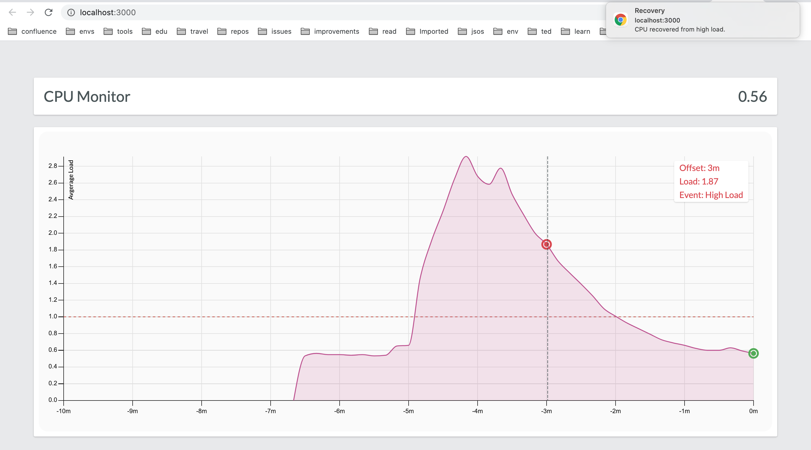

# CPU Monitor App POC

Client-server CPU monitoring application built in TypeScript.



## For The Reviewer

Dear Reviewer,

I hope you enjoy my work and the code will appear clear to you.

In case you have any questions or trouble starting the app please reach me out by E-Mail: andrei.zhaleznichenka@gmail.com.

Have Fun!

## Limitations

The monitoring agent is designed to support UNIX-machines only and it will show no load if running on a Windows computer.

## How To Use

Dear Windows user, please start the application [using Docker](#run-with-docker).

### Run with Yarn

First, install the external dependencies:

```
yarn install
```

Then, build the internal dependencies:

```
yarn deps
```

Now, you can run the agent and the client separately, using:

```
yarn agent start

yarn client start
```

### Run with Docker

Build the images:

```
docker-compose build
```

Run the containers:

```
docker-compose up
```

Now you can open `http://localhost:3000` in your browser.

If necessary, you can stop/start the container using:

```
docker-compose stop monitor-agent

docker-compose start monitor-agent
```

Or, you can enter the container shell using:

```
docker exec -it monitor-agent sh
```

### Simulating high load

To simulate a high load you can use the debug script:

```
bash ./debug/simulate-load.sh
```

If necessary, you can run it in multiple processes.

Alternatively, just open a bunch of tabs simultaneously in your favorite browser.

## Solution Description

The application shows the 10-minute frame of average CPU load information as well as events within the same timeframe indicating if the system was under heavy load recently and whether it has been recovered since then.

The user can see all events within the timeframe in the chart and every new event is also shown as a push-notification.

In case the agent is down, the client part would show the previously fetched data until the agent is back online. In that case, the old data would be erased as there is no tracking implemented to handle the unavailability gap.

The application does not store the actual timestamps of the measurements taken as those absolute values are mostly relevant for logging/reporting and not that much needed for the client-server interaction.

The events are emitted when the continuous sequence of load values above or below the threshold reaches a span of 2 minutes.

## Next Steps

To make the application more suitable for the production use, the following improvements are to be considered:

- Introducing the production pipeline of two steps: build and deploy. In the build step, a bundler can be used to create small and optimized chunks of code having all the dependencies backed in. The deploy step must ensure no development configuration is being used and the security requirements are met (e.g. CORS is to be handler properly with the service to be aware of the exact domain of the client).
- The server part should be integrated into the target infrastructure, supporting the health-check, events logging and, most-likely, persistence or reporting of the data.
- To support data persistence/reporting, the data should be enriched with the timestamps, ensuring time synchronization with the rest of the system.
- The configuration of the service might need to be extended if it is necessary to maintain a wider timeframe. For the large timeframes, it might be necessary to display only its subset on the client by selecting the start- and end-boundaries. For extra-large timeframes, when the memory could be a limit, a scaling solution can be introduced for the server and client to use the floating tick interval (e.g. 10s for a small scale and 10m for a large one).
- Providing more unit and e2e tests to ensure all requirements are met and to support future maintenance.
